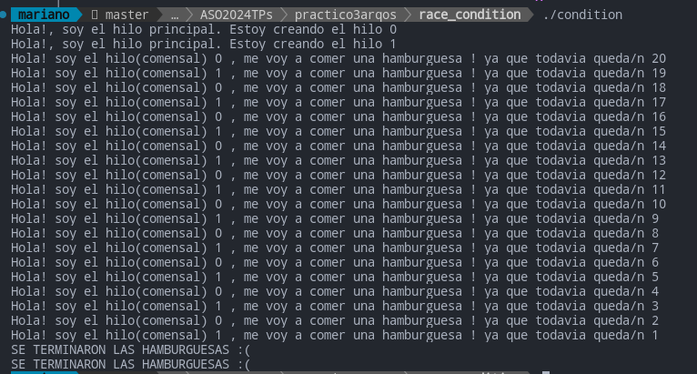
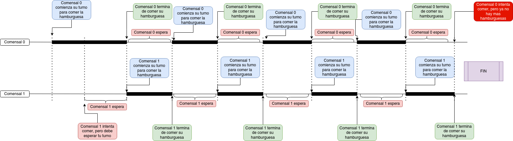
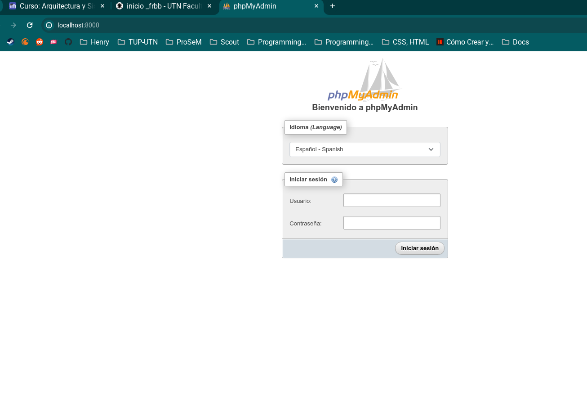
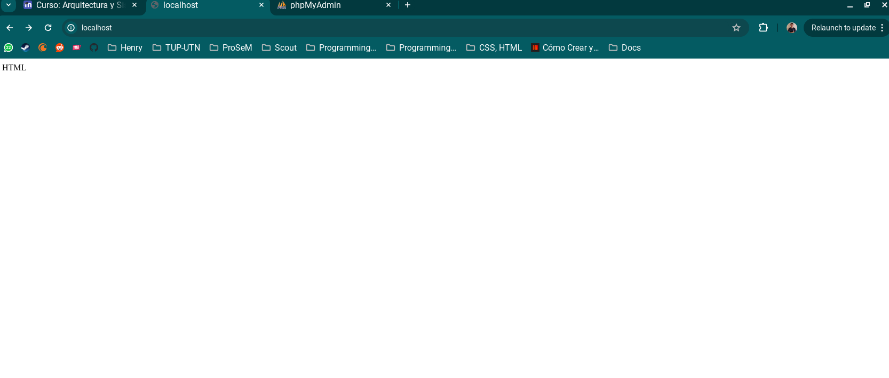

<h1>Trabajo Practico N°1</h1>

<h1>Trabajo Practico N°2</h1>

<h1>Trabajo Practico N°3</h1>

1A)
En el codigo de conhilos.py se puede ver como comienzan las tareas a ejecutarse en paralelo y van terminando dependiendo el tiempo que lleve cada una. Todo el proceso lleva 4 segundos y centimas ya que toma todo el procedimiento desde que empieza hasta que termina la ultima tarea la cual tiene 4 seg de espera, haciendo que el tiempo de ejecucion este dominado por la tarea 3.
  Luego en el codigo de sinhilos.py al no tener hilos genera que se ejecute tarea por tarea, es decir, hasta que no finalice una tarea no comenzara la que le sigue, lo que hace que lleve mas tiempo. En este caso se ve como lleva mas tiempo que el otro codigo que si tiene hilos, ya que es 1 segundo de la tarea 2 mas 4 segundos de la tarea 3 haciendo que el tiempo de ejecucion sea de 5 y centimas, esas centimas es lo que lleva la tarea 1 que es minimo.

1B)
Despues de compartir con varios compañeros nos da el mismo tiempo de ejecucion en ambos archivos, solamente varian las centimas pero tambien varian en varias ejecuciones propias del archivo.

1C)
Antes de descomentar, cuando ejecuto el archivo sin bucles internos el valor final me da 0 y el tiempo que toma es menos de 1 segundo (0.01... segundos) debido a la falta de sincronizacion entre ambos hilos que genera los resultados dados y debido a no contener bucles internos no consume tanto tiempo. 
  En cambio cuando ejecuto con bucles internos el tiempo de ejecucion aumenta (1 segundo y centimas) ya que causa retraso en cada iteracion de la suma y en la resta, haciendo que esto pueda generar resultados mas predecibles que el caso anterior. Pero debido a la no sincronizacion hace que se generen distintos resultados en las distintas ejecuciones.

2A)
<a href="./trabajoPractico3/race_condition/con_race_condition.c">Puzzle Resuelto</a> 
  

2B)

<h1>Trabajo Practico N°4</h1>

A)

B)

C)

